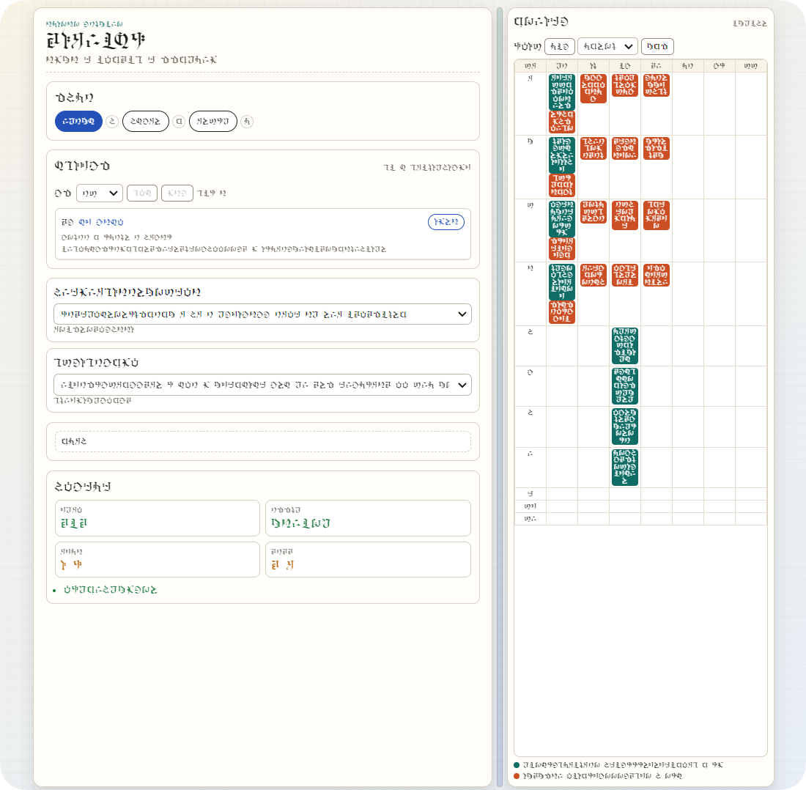

# 重邮重修课表规划器（可复用本地版）

[中文说明](README.zh-CN.md) | [English](README.md)

面向场景：在选课/重修/免修申请时，官方页面可能没有完整实时课表，但你又希望到堂听课并提前规避冲突。

## 0. 这个项目能做什么，有什么用

这个项目可以把你从教务系统页面 Ctrl+S 保存下来的课表文件（优先 mhtml）自动处理成可规划数据，然后给你：
- 全量可行方案（零冲突）
- 按分数排序的候选方案
- 一键预览方案
- 实时周课表小窗（默认全周叠加，也可切换第 N 周）
- 数据审计报告（知道每条数据是否被保留、为什么被丢弃）

核心价值：
- 从“看不清重修课怎么排”变成“可比较、可追溯、可落地”的决策流程。
- 提供设置面板：支持暗色模式、演示模式（加密映射 / 全随机字符）与中英文切换。

## 1. 本项目是 VibeCoding 产物

是的，本项目是 VibeCoding 风格的工程化产物：
- 先跑通、再迭代
- 以可复用和本地可部署为优先
- 文档与脚本尽量让非开发者也能操作
- 同时采用 AI Agent Coding 工作流，用于加速脚本实现、验证与迭代

演示模式可选接入第三方字体（如 HoYo-Glyphs 项目），相关字体设计与版权归其权利方所有。

## 2. 适用于重邮（CQUPT）说明

本项目在重庆邮电大学（CQUPT）选课系统课表页面导出数据上进行了验证。

已验证输入形式：
- 浏览器 Ctrl+S 保存的 .mhtml
- .xlsx（兼容）

注意：如果学校系统结构改版，可能需要调整解析规则。

## 3. 免责说明

- 本工具仅用于个人选课规划辅助，不是学校官方系统。
- 最终选课结果、名额状态、政策解释，以学校官方平台和通知为准。
- 使用者需自行核验关键决策（例如毕业学分、课程属性、时间冲突、审批规则）。
- 本项目作者/维护者不对因使用本工具导致的直接或间接后果承担责任。

## 快速开始

1. 安装依赖

pip install -r requirements.txt

2. 把课表文件放入 input

推荐直接使用教务系统页面 Ctrl+S 保存为 .mhtml。

3. 生成数据

python scripts/build_data.py

4. 启动本地网页

python scripts/serve.py --port 8016

5. 浏览器打开

http://127.0.0.1:8016

## 效果预览

## 示例流程：从教务在线到可规划课表

下面给一个可直接照做的示例（以重修某门课为例）：

1. 打开学校教务在线并登录账号。
2. 进入“课表查询”相关入口（不同学期命名可能略有差异）。
3. 点击“课程查询”（或“开课查询”）页面。
4. 在搜索框输入课程关键字（如课程名、课程代码、教师名），执行查询。
5. 在结果列表点击某一门课程，进入该课程详情/排课信息页面。
6. 在该页面按 `Ctrl+S`，保存为“网页，单个文件（*.mhtml）”。
7. 文件名建议包含课程信息，便于后续识别，例如：
	- `高等数学A.mhtml`
	- `大学英语B.mhtml`
8. 将保存好的 `.mhtml`（或 `.xlsx`）文件统一放入 `input/` 目录。
9. 在项目根目录执行：`python scripts/build_data.py`，生成标准化数据。
10. 执行：`python scripts/serve.py --port 8016`，打开浏览器访问 `http://127.0.0.1:8016`。
11. 在页面中查看预设方案、全量排名和实时周课表，按冲突与偏好筛选最终方案。

补充建议：
- 优先使用 `.mhtml`，信息完整度通常更好。
- 保存前确认页面已完全加载（包含教师、周次、节次等字段）。
- 如果同一课程保存了多份页面，命名里加上教师/班号可显著降低后续混淆。
